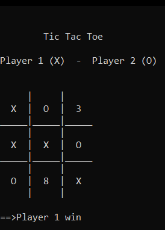

# OOP
This is my college final project for Object Oriented Programming

## About the Program
This program is a tic tac toe game which can be played by two user 

## What I've Learned
Using C++ language to implement array, and how to use method and class

## Screenshot
#### First Turn

#### Second Turn

#### Win Cond

